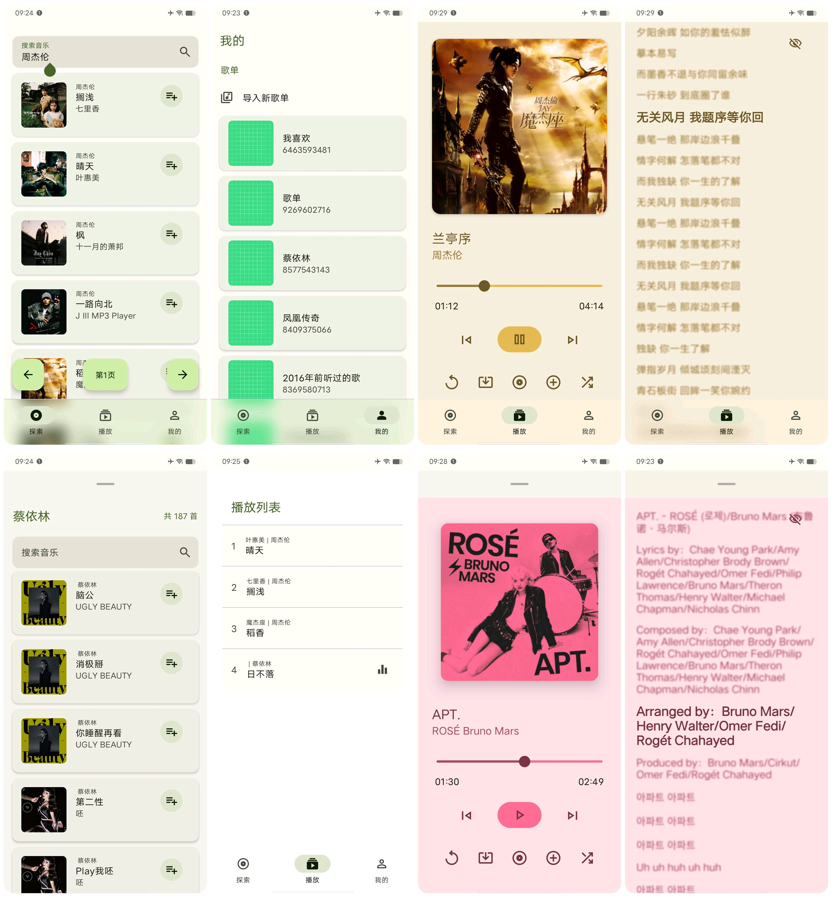

# 婉婉动听
## 介绍
这是一款测试[QMX-API](https://github.com/Chiu-xaH/QMX-API)接口的客户端，仅供学习用途，QMX-API将QQ音乐接口封装，可从中获取音乐
## 权限
## 截图

## 版本
Insider Preview（完成度较低，由于本周需要复习备考，暂停停更）
### 已实现
搜索听歌

歌词滚动 歌词模糊 背景取色

播放器 进度条 暂停 停止 上下曲

歌单导入

播放列表

### 待实现

自行OTA

歌单播放时的专辑图片

随机播放

下载

管理播放列表

深色背景

...
